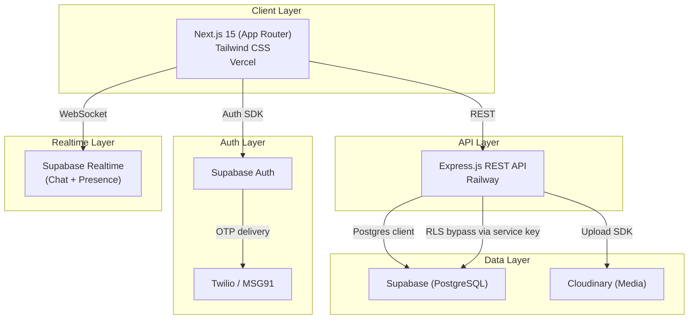
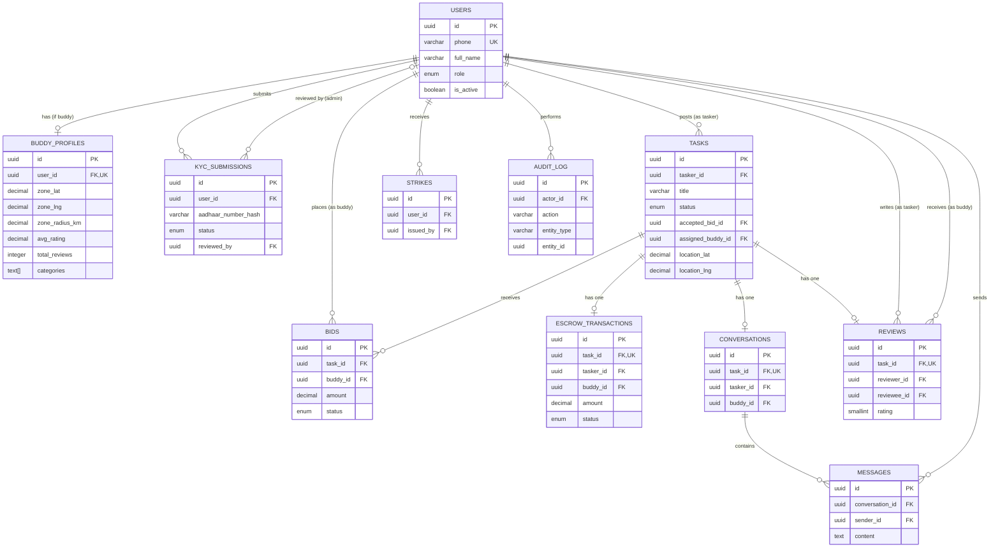
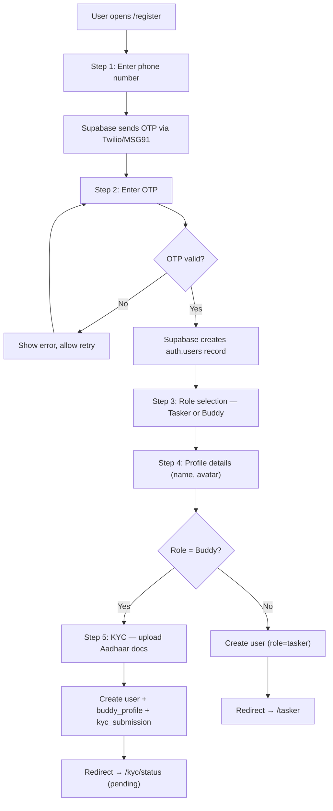
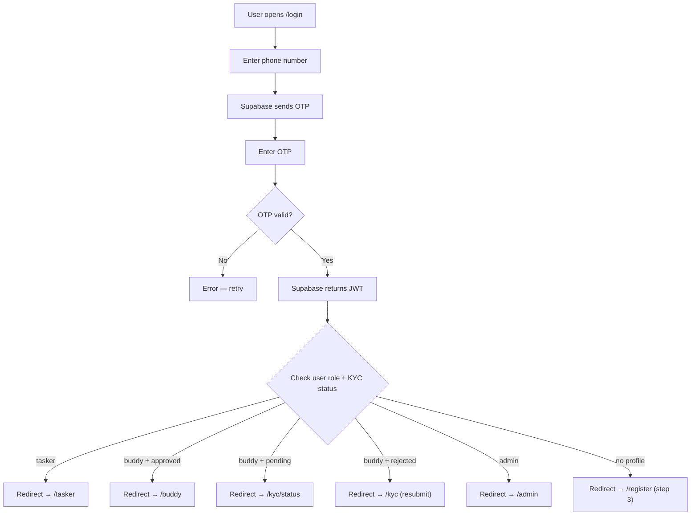
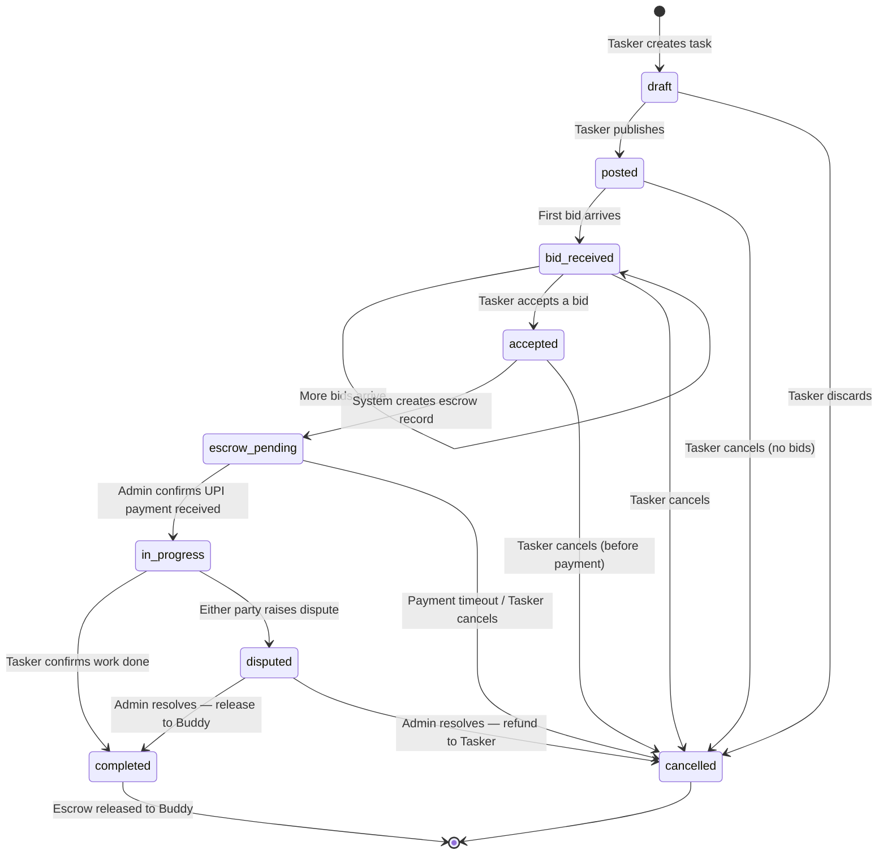
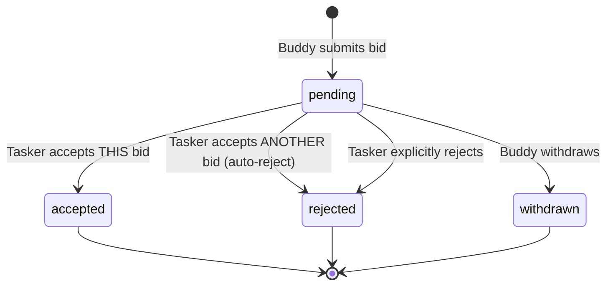
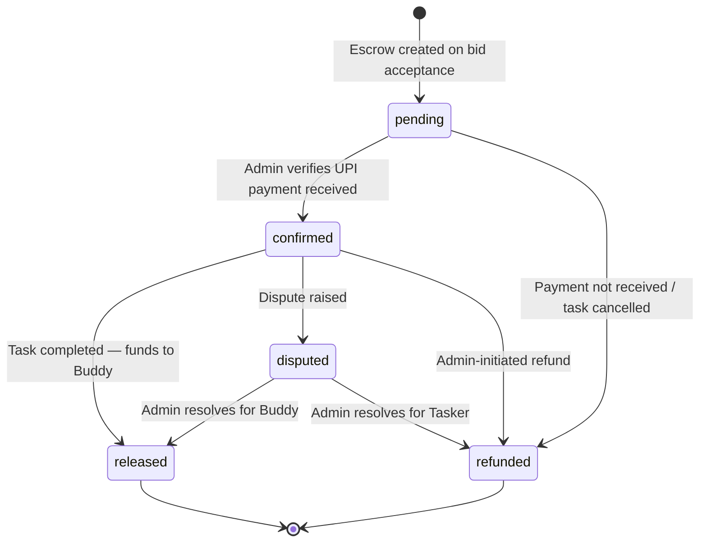
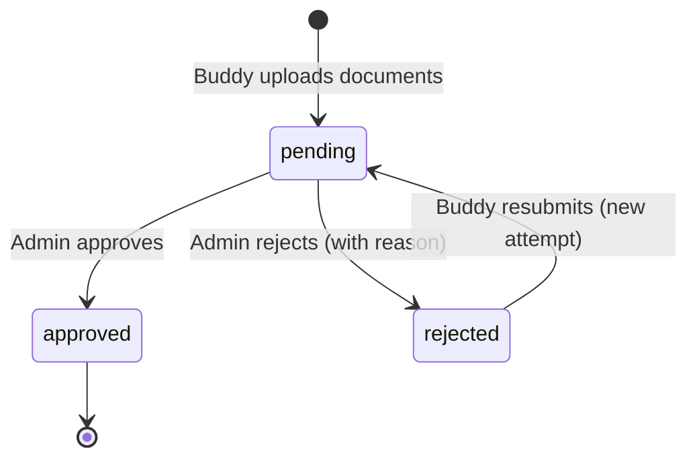

# BuddyAcross — Technical Design Document

> **Author:** CTO / Lead Architect
> **Date:** June 26, 2026
> **Status:** Draft — Awaiting Founder Review
> **Source of truth:** [BuddyAcross_Proposal.pdf](file:///Users/pc/Desktop/BuddyAcross/BuddyAcross_Proposal.pdf)

---

## Executive Summary

BuddyAcross is a hyperlocal task marketplace connecting **Taskers** (people who need help) with **Buddies** (verified service providers) in their neighbourhood. The MVP validates a single loop: **Post → Bid → Accept → Pay (Escrow) → Complete → Review**.

This document is the architectural blueprint for the production MVP. Every decision below optimises for three constraints:

1. **Ship in 2–3 weeks** with one developer.
2. **Manual-first** — no payment gateway, no push notifications, no AI.
3. **Architecture must not be thrown away** when we add 100k users, native apps, Razorpay, and push notifications post-MVP.

---

## Table of Contents

1. [High-Level System Architecture](#1-high-level-system-architecture)
2. [Folder Structure](#2-folder-structure)
3. [Route Map](#3-route-map)
4. [Database Design](#4-database-design)
5. [Entity Relationship Diagram](#5-entity-relationship-diagram)
6. [Authentication Flow](#6-authentication-flow)
7. [Complete State Machine](#7-complete-state-machine)
8. [Component Hierarchy](#8-component-hierarchy)
9. [API Endpoints](#9-api-endpoints)
10. [Development Roadmap](#10-development-roadmap)
11. [Potential Technical Risks](#11-potential-technical-risks)
12. [Scaling Considerations](#12-scaling-considerations)

---

## 1. High-Level System Architecture



### Layer Breakdown

| Layer | Technology | Deployment | Why |
|---|---|---|---|
| **Frontend** | Next.js 15 (App Router), Tailwind CSS | Vercel | SSR for SEO (landing, profiles), client components for dashboards. Vercel gives zero-config deploys. |
| **Backend** | Node.js + Express | Railway | Thin REST API that owns business logic — escrow state, bid validation, KYC approval. Keeps logic out of the frontend and RLS policies. |
| **Database** | PostgreSQL via Supabase | Supabase Cloud | Managed Postgres with built-in auth, realtime, and RLS. No DevOps burden. |
| **Authentication** | Supabase Auth + Twilio/MSG91 | Supabase Cloud | Phone OTP out of the box. JWT tokens. Role claims via custom `app_metadata`. |
| **Storage** | Cloudinary | Cloudinary Cloud | Aadhaar doc uploads, profile photos, task images. Transformation URLs for thumbnails. |
| **Realtime** | Supabase Realtime | Supabase Cloud | WebSocket channels for 1:1 chat. No separate infra. Channel-level RLS for access control. |

> [!IMPORTANT]
> The Express backend is **not optional**. Supabase Edge Functions could theoretically replace it, but Express gives us: (a) full control over escrow state transitions, (b) admin-only operations without exposing the service key to the client, (c) a clean migration path to a standalone API when we outgrow Supabase.

---

## 2. Folder Structure

```
buddyacross/
├── apps/
│   ├── web/                          # Next.js 15 frontend
│   │   ├── app/                      # App Router — file-based routing
│   │   │   ├── (auth)/               # Route group: unauthenticated pages
│   │   │   │   ├── login/
│   │   │   │   │   └── page.tsx
│   │   │   │   ├── register/
│   │   │   │   │   └── page.tsx
│   │   │   │   └── layout.tsx        # Minimal layout — no sidebar
│   │   │   ├── (dashboard)/          # Route group: authenticated pages
│   │   │   │   ├── tasker/
│   │   │   │   │   ├── page.tsx      # Tasker dashboard home
│   │   │   │   │   ├── tasks/
│   │   │   │   │   │   ├── new/
│   │   │   │   │   │   │   └── page.tsx
│   │   │   │   │   │   └── [id]/
│   │   │   │   │   │       └── page.tsx
│   │   │   │   │   └── layout.tsx
│   │   │   │   ├── buddy/
│   │   │   │   │   ├── page.tsx      # Buddy dashboard home
│   │   │   │   │   ├── browse/
│   │   │   │   │   │   └── page.tsx  # Browse available tasks
│   │   │   │   │   ├── my-bids/
│   │   │   │   │   │   └── page.tsx
│   │   │   │   │   └── layout.tsx
│   │   │   │   ├── chat/
│   │   │   │   │   ├── page.tsx      # Chat list
│   │   │   │   │   └── [conversationId]/
│   │   │   │   │       └── page.tsx  # Chat thread
│   │   │   │   ├── profile/
│   │   │   │   │   └── page.tsx      # Own profile / settings
│   │   │   │   ├── kyc/
│   │   │   │   │   └── page.tsx      # KYC submission for Buddies
│   │   │   │   └── layout.tsx        # Sidebar + topbar layout
│   │   │   ├── (admin)/              # Route group: admin panel
│   │   │   │   ├── admin/
│   │   │   │   │   ├── page.tsx      # Admin dashboard / analytics
│   │   │   │   │   ├── kyc/
│   │   │   │   │   │   ├── page.tsx  # KYC queue
│   │   │   │   │   │   └── [id]/
│   │   │   │   │   │       └── page.tsx  # KYC detail review
│   │   │   │   │   ├── users/
│   │   │   │   │   │   ├── page.tsx
│   │   │   │   │   │   └── [id]/
│   │   │   │   │   │       └── page.tsx
│   │   │   │   │   ├── tasks/
│   │   │   │   │   │   ├── page.tsx
│   │   │   │   │   │   └── [id]/
│   │   │   │   │   │       └── page.tsx
│   │   │   │   │   ├── escrow/
│   │   │   │   │   │   └── page.tsx
│   │   │   │   │   ├── reviews/
│   │   │   │   │   │   └── page.tsx
│   │   │   │   │   └── layout.tsx    # Admin layout — different sidebar
│   │   │   ├── buddy/
│   │   │   │   └── [id]/
│   │   │   │       └── page.tsx      # Public Buddy profile (SSR)
│   │   │   ├── page.tsx              # Landing page (SSR)
│   │   │   ├── layout.tsx            # Root layout — providers, fonts
│   │   │   └── not-found.tsx
│   │   ├── components/               # Shared React components
│   │   │   ├── ui/                   # Primitives: Button, Input, Modal, Card, Badge
│   │   │   ├── layout/              # Sidebar, Topbar, Footer, MobileNav
│   │   │   ├── forms/               # TaskForm, BidForm, ReviewForm, KycForm
│   │   │   ├── cards/               # TaskCard, BidCard, UserCard, ReviewCard
│   │   │   ├── chat/                # ChatBubble, ChatInput, ChatList
│   │   │   ├── data-tables/         # AdminTable, Pagination, Filters
│   │   │   └── providers/           # AuthProvider, QueryProvider, ThemeProvider
│   │   ├── hooks/                    # Custom React hooks
│   │   │   ├── use-auth.ts
│   │   │   ├── use-tasks.ts
│   │   │   ├── use-bids.ts
│   │   │   ├── use-chat.ts
│   │   │   └── use-escrow.ts
│   │   ├── lib/                      # Utility layer
│   │   │   ├── api-client.ts         # Axios/fetch wrapper for Express API
│   │   │   ├── supabase/
│   │   │   │   ├── client.ts         # Browser Supabase client
│   │   │   │   └── server.ts         # Server-component Supabase client
│   │   │   ├── cloudinary.ts         # Upload helper
│   │   │   └── utils.ts             # Formatters, validators
│   │   ├── styles/
│   │   │   └── globals.css           # Tailwind directives + custom tokens
│   │   ├── public/                   # Static assets
│   │   ├── middleware.ts             # Auth guard + role redirect
│   │   ├── next.config.ts
│   │   ├── tailwind.config.ts
│   │   ├── tsconfig.json
│   │   └── package.json
│   │
│   └── api/                          # Express backend
│       ├── src/
│       │   ├── index.ts              # Server entry — app.listen()
│       │   ├── app.ts                # Express app factory — middleware, routes
│       │   ├── config/
│       │   │   ├── env.ts            # Zod-validated env vars
│       │   │   ├── supabase.ts       # Supabase admin client (service key)
│       │   │   └── cloudinary.ts     # Cloudinary config
│       │   ├── middleware/
│       │   │   ├── auth.ts           # JWT verification + role extraction
│       │   │   ├── role-guard.ts     # Role-based access (admin, buddy, tasker)
│       │   │   ├── kyc-guard.ts      # Blocks unverified Buddies from bidding
│       │   │   ├── validate.ts       # Zod request validation
│       │   │   └── error-handler.ts  # Global error handler
│       │   ├── routes/
│       │   │   ├── auth.routes.ts
│       │   │   ├── users.routes.ts
│       │   │   ├── tasks.routes.ts
│       │   │   ├── bids.routes.ts
│       │   │   ├── escrow.routes.ts
│       │   │   ├── chat.routes.ts
│       │   │   ├── reviews.routes.ts
│       │   │   ├── kyc.routes.ts
│       │   │   ├── admin.routes.ts
│       │   │   └── upload.routes.ts
│       │   ├── controllers/          # Request handlers — thin, delegate to services
│       │   │   ├── auth.controller.ts
│       │   │   ├── users.controller.ts
│       │   │   ├── tasks.controller.ts
│       │   │   ├── bids.controller.ts
│       │   │   ├── escrow.controller.ts
│       │   │   ├── chat.controller.ts
│       │   │   ├── reviews.controller.ts
│       │   │   ├── kyc.controller.ts
│       │   │   ├── admin.controller.ts
│       │   │   └── upload.controller.ts
│       │   ├── services/             # Business logic — owns state machines
│       │   │   ├── auth.service.ts
│       │   │   ├── user.service.ts
│       │   │   ├── task.service.ts
│       │   │   ├── bid.service.ts
│       │   │   ├── escrow.service.ts
│       │   │   ├── chat.service.ts
│       │   │   ├── review.service.ts
│       │   │   ├── kyc.service.ts
│       │   │   ├── admin.service.ts
│       │   │   └── upload.service.ts
│       │   ├── validators/           # Zod schemas for each route
│       │   │   ├── task.schema.ts
│       │   │   ├── bid.schema.ts
│       │   │   ├── review.schema.ts
│       │   │   └── kyc.schema.ts
│       │   └── types/                # Shared TypeScript types (re-exported from packages/)
│       │       └── index.ts
│       ├── tsconfig.json
│       └── package.json
│
├── packages/
│   └── shared/                       # Shared between web + api
│       ├── src/
│       │   ├── types/                # DTOs, enums, interfaces
│       │   │   ├── user.ts
│       │   │   ├── task.ts
│       │   │   ├── bid.ts
│       │   │   ├── escrow.ts
│       │   │   ├── review.ts
│       │   │   ├── kyc.ts
│       │   │   ├── chat.ts
│       │   │   └── api-response.ts
│       │   ├── constants/            # Enums, status codes, categories
│       │   │   ├── roles.ts
│       │   │   ├── task-status.ts
│       │   │   ├── bid-status.ts
│       │   │   ├── escrow-status.ts
│       │   │   ├── kyc-status.ts
│       │   │   └── categories.ts
│       │   └── validators/           # Shared Zod schemas
│       │       ├── task.schema.ts
│       │       └── bid.schema.ts
│       ├── tsconfig.json
│       └── package.json
│
├── supabase/
│   ├── migrations/                   # SQL migration files (sequential)
│   ├── seed.sql                      # Dev seed data
│   └── config.toml                   # Supabase local config
│
├── turbo.json                        # Turborepo pipeline config
├── package.json                      # Root workspace — npm workspaces
├── .env.example
├── .gitignore
└── README.md
```

### Why Every Folder Exists

| Folder | Rationale |
|---|---|
| `apps/web/` | Next.js 15 frontend. Separated from API so Vercel deploys only this. |
| `apps/web/app/(auth)/` | Route group for unauthenticated pages. Shares a minimal layout without sidebar. Parentheses prevent `/auth/` from appearing in the URL. |
| `apps/web/app/(dashboard)/` | Route group for all authenticated user-facing pages. Shares a sidebar layout. Roles (tasker/buddy) get separate sub-routes so each role has a distinct navigation experience. |
| `apps/web/app/(admin)/` | Isolated admin panel with its own layout and heavier data-table components. Separate route group prevents admin code from leaking into user bundles. |
| `apps/web/app/buddy/[id]/` | Public profile page — outside auth groups so it's SSR-accessible without login. |
| `apps/web/components/ui/` | Design system primitives. Every component in the app composes these. Prevents style drift. |
| `apps/web/components/forms/` | Form components with embedded validation. Reused across create/edit flows. |
| `apps/web/components/cards/` | Display components for list views. Consistent card pattern across tasks, bids, users. |
| `apps/web/components/chat/` | Chat-specific components that depend on Supabase Realtime. Isolated so realtime subscriptions don't leak into other pages. |
| `apps/web/components/providers/` | React context providers mounted at root layout. Auth, React Query, theme. |
| `apps/web/hooks/` | Custom hooks encapsulating API calls + state. Components stay declarative; data-fetching logic is reusable. |
| `apps/web/lib/` | Non-React utility code. API client, Supabase client factories, helpers. |
| `apps/web/middleware.ts` | Next.js middleware for auth guards. Redirects unauthenticated users, routes users to correct dashboard by role, blocks unverified Buddies from marketplace. |
| `apps/api/src/routes/` | Express route definitions. Each file maps 1:1 to a domain entity. |
| `apps/api/src/controllers/` | Thin layer — parse request, call service, format response. No business logic here. |
| `apps/api/src/services/` | **All business logic lives here.** State machine transitions, authorization checks, escrow validations. This is the brain of the backend. |
| `apps/api/src/middleware/` | Cross-cutting concerns: auth verification, role checks, KYC status checks, input validation, error handling. |
| `apps/api/src/validators/` | Zod schemas for request bodies. Imported by the `validate` middleware. |
| `packages/shared/` | Types, enums, and validators shared between frontend and backend. Single source of truth for `TaskStatus`, `BidStatus`, etc. Prevents type drift across apps. |
| `supabase/` | Migration files and seed data. Checked into git so schema is reproducible. `supabase db push` applies migrations. |

> [!TIP]
> We use **Turborepo** (`turbo.json`) at the root to orchestrate builds across `apps/web`, `apps/api`, and `packages/shared`. This is simpler than Nx for a two-app monorepo and has first-class Vercel support.

---

## 3. Route Map

### Public Routes (No Auth)

| Route | Page | Rendering |
|---|---|---|
| `/` | Landing page — hero, how-it-works, CTA | SSR |
| `/login` | Phone + OTP login | Client |
| `/register` | Role selection → registration flow | Client |
| `/buddy/:id` | Public Buddy profile (ratings, reviews, bio) | SSR |

### Tasker Routes (Role: `tasker`)

| Route | Page |
|---|---|
| `/tasker` | Tasker dashboard — my posted tasks, stats |
| `/tasker/tasks/new` | Create new task form |
| `/tasker/tasks/:id` | Task detail — bids received, bid comparison, accept |
| `/tasker/tasks/:id/pay` | Escrow payment page (UPI instructions) |

### Buddy Routes (Role: `buddy`, KYC: `approved`)

| Route | Page |
|---|---|
| `/buddy` | Buddy dashboard — active tasks, earnings summary |
| `/buddy/browse` | Browse available tasks in my zone |
| `/buddy/my-bids` | My submitted bids and their status |

### Shared Authenticated Routes

| Route | Page |
|---|---|
| `/chat` | Conversation list |
| `/chat/:conversationId` | Chat thread (1:1, post-bid-acceptance) |
| `/profile` | View/edit own profile |
| `/kyc` | KYC submission form (Buddy only — redirects Taskers) |
| `/kyc/status` | KYC submission status (pending / approved / rejected) |

### Admin Routes (Role: `admin`)

| Route | Page |
|---|---|
| `/admin` | Admin dashboard — analytics overview |
| `/admin/kyc` | KYC review queue (pending submissions) |
| `/admin/kyc/:id` | KYC detail — document viewer, approve/reject |
| `/admin/users` | User management table |
| `/admin/users/:id` | User detail — profile, tasks, reviews, strikes |
| `/admin/tasks` | All tasks — filterable by status |
| `/admin/tasks/:id` | Task detail — bids, escrow, chat logs |
| `/admin/escrow` | Escrow management — pending releases |
| `/admin/reviews` | Review moderation — flagged reviews, strike system |

### Middleware Redirect Logic

```
Unauthenticated → /login
Authenticated + no role selected → /register (step 2: role selection)
Authenticated + role=tasker → /tasker
Authenticated + role=buddy + kyc=pending → /kyc/status
Authenticated + role=buddy + kyc=approved → /buddy
Authenticated + role=buddy + kyc=rejected → /kyc (resubmit)
Authenticated + role=admin → /admin
```

---

## 4. Database Design

> All tables use UUIDs as primary keys, `created_at` / `updated_at` timestamps, and soft deletes via `deleted_at`. All foreign keys cascade on delete to the `deleted_at` column (soft), never hard-delete.

---

### 4.1 `users`

| Column | Type | Constraints | Notes |
|---|---|---|---|
| `id` | `uuid` | PK, default `gen_random_uuid()` | Maps to Supabase `auth.users.id` |
| `phone` | `varchar(15)` | UNIQUE, NOT NULL | E.164 format |
| `full_name` | `varchar(100)` | NOT NULL | |
| `avatar_url` | `text` | NULLABLE | Cloudinary URL |
| `role` | `enum('tasker','buddy','admin')` | NOT NULL | Set during onboarding |
| `is_active` | `boolean` | DEFAULT `true` | Admin can deactivate |
| `created_at` | `timestamptz` | DEFAULT `now()` | |
| `updated_at` | `timestamptz` | DEFAULT `now()` | Trigger-updated |
| `deleted_at` | `timestamptz` | NULLABLE | Soft delete |

**Indexes:**
- `idx_users_phone` — UNIQUE on `phone`
- `idx_users_role` — B-tree on `role` (admin queries by role)
- `idx_users_deleted_at` — Partial index `WHERE deleted_at IS NULL`

---

### 4.2 `buddy_profiles`

| Column | Type | Constraints | Notes |
|---|---|---|---|
| `id` | `uuid` | PK | |
| `user_id` | `uuid` | FK → `users.id`, UNIQUE, NOT NULL | 1:1 with users |
| `bio` | `text` | NULLABLE | |
| `zone_lat` | `decimal(9,6)` | NOT NULL | Service area center |
| `zone_lng` | `decimal(9,6)` | NOT NULL | |
| `zone_radius_km` | `decimal(5,2)` | DEFAULT `5.0` | Service radius |
| `avg_rating` | `decimal(3,2)` | DEFAULT `0.00` | Denormalized for perf |
| `total_reviews` | `integer` | DEFAULT `0` | Denormalized |
| `total_tasks_completed` | `integer` | DEFAULT `0` | Denormalized |
| `categories` | `text[]` | NOT NULL | Array of category slugs |
| `created_at` | `timestamptz` | DEFAULT `now()` | |
| `updated_at` | `timestamptz` | DEFAULT `now()` | |
| `deleted_at` | `timestamptz` | NULLABLE | |

**Indexes:**
- `idx_buddy_profiles_user_id` — UNIQUE on `user_id`
- `idx_buddy_profiles_location` — GiST index on `point(zone_lng, zone_lat)` for proximity queries
- `idx_buddy_profiles_categories` — GIN index on `categories` for category filtering

---

### 4.3 `kyc_submissions`

| Column | Type | Constraints | Notes |
|---|---|---|---|
| `id` | `uuid` | PK | |
| `user_id` | `uuid` | FK → `users.id`, NOT NULL | |
| `aadhaar_number_hash` | `varchar(64)` | NOT NULL | SHA-256 hash — never store plaintext |
| `document_front_url` | `text` | NOT NULL | Cloudinary URL |
| `document_back_url` | `text` | NOT NULL | Cloudinary URL |
| `selfie_url` | `text` | NULLABLE | Face match photo |
| `status` | `enum('pending','approved','rejected')` | DEFAULT `'pending'` | |
| `reviewed_by` | `uuid` | FK → `users.id`, NULLABLE | Admin who reviewed |
| `reviewed_at` | `timestamptz` | NULLABLE | |
| `rejection_reason` | `text` | NULLABLE | Required if rejected |
| `attempt_number` | `integer` | DEFAULT `1` | Track resubmissions |
| `created_at` | `timestamptz` | DEFAULT `now()` | |
| `updated_at` | `timestamptz` | DEFAULT `now()` | |
| `deleted_at` | `timestamptz` | NULLABLE | |

**Indexes:**
- `idx_kyc_user_id` — on `user_id`
- `idx_kyc_status` — on `status` (admin queries pending KYCs)
- `idx_kyc_aadhaar_hash` — on `aadhaar_number_hash` (prevent duplicate Aadhaar)

**Constraints:**
- `chk_rejection_reason` — `CHECK (status != 'rejected' OR rejection_reason IS NOT NULL)`
- `chk_reviewed_fields` — `CHECK ((status = 'pending') OR (reviewed_by IS NOT NULL AND reviewed_at IS NOT NULL))`

---

### 4.4 `tasks`

| Column | Type | Constraints | Notes |
|---|---|---|---|
| `id` | `uuid` | PK | |
| `tasker_id` | `uuid` | FK → `users.id`, NOT NULL | Who posted |
| `title` | `varchar(150)` | NOT NULL | |
| `description` | `text` | NOT NULL | |
| `category` | `varchar(50)` | NOT NULL | From predefined list |
| `budget_min` | `decimal(10,2)` | NOT NULL | ₹ |
| `budget_max` | `decimal(10,2)` | NOT NULL | ₹ |
| `location_lat` | `decimal(9,6)` | NOT NULL | Task location |
| `location_lng` | `decimal(9,6)` | NOT NULL | |
| `location_address` | `text` | NOT NULL | Human-readable address |
| `status` | `enum(...)` | NOT NULL, DEFAULT `'draft'` | See state machine §7 |
| `accepted_bid_id` | `uuid` | FK → `bids.id`, NULLABLE | Set when Tasker accepts |
| `assigned_buddy_id` | `uuid` | FK → `users.id`, NULLABLE | Denormalized from accepted bid |
| `completed_at` | `timestamptz` | NULLABLE | When Tasker confirms completion |
| `cancelled_at` | `timestamptz` | NULLABLE | When cancelled |
| `cancellation_reason` | `text` | NULLABLE | |
| `image_urls` | `text[]` | NULLABLE | Task photos |
| `created_at` | `timestamptz` | DEFAULT `now()` | |
| `updated_at` | `timestamptz` | DEFAULT `now()` | |
| `deleted_at` | `timestamptz` | NULLABLE | |

**Task Status Enum Values:**
`'draft'`, `'posted'`, `'bid_received'`, `'accepted'`, `'escrow_pending'`, `'in_progress'`, `'completed'`, `'cancelled'`, `'disputed'`

**Indexes:**
- `idx_tasks_tasker_id` — on `tasker_id`
- `idx_tasks_status` — on `status`
- `idx_tasks_location` — GiST on `point(location_lng, location_lat)` for geo queries
- `idx_tasks_category` — on `category`
- `idx_tasks_created_at` — on `created_at DESC` (newest first)
- `idx_tasks_assigned_buddy` — on `assigned_buddy_id` where NOT NULL

**Constraints:**
- `chk_budget_range` — `CHECK (budget_min > 0 AND budget_max >= budget_min)`
- `chk_cancelled_reason` — `CHECK (status != 'cancelled' OR cancellation_reason IS NOT NULL)`

---

### 4.5 `bids`

| Column | Type | Constraints | Notes |
|---|---|---|---|
| `id` | `uuid` | PK | |
| `task_id` | `uuid` | FK → `tasks.id`, NOT NULL | |
| `buddy_id` | `uuid` | FK → `users.id`, NOT NULL | |
| `amount` | `decimal(10,2)` | NOT NULL | Proposed price ₹ |
| `message` | `text` | NULLABLE | Cover letter |
| `estimated_duration` | `varchar(50)` | NULLABLE | e.g. "2 hours" |
| `status` | `enum('pending','accepted','rejected','withdrawn')` | DEFAULT `'pending'` | |
| `created_at` | `timestamptz` | DEFAULT `now()` | |
| `updated_at` | `timestamptz` | DEFAULT `now()` | |
| `deleted_at` | `timestamptz` | NULLABLE | |

**Indexes:**
- `idx_bids_task_id` — on `task_id`
- `idx_bids_buddy_id` — on `buddy_id`
- `idx_bids_status` — on `status`
- `idx_bids_unique_active` — UNIQUE on `(task_id, buddy_id)` WHERE `deleted_at IS NULL` (one bid per buddy per task)

**Constraints:**
- `chk_bid_amount` — `CHECK (amount > 0)`

---

### 4.6 `escrow_transactions`

| Column | Type | Constraints | Notes |
|---|---|---|---|
| `id` | `uuid` | PK | |
| `task_id` | `uuid` | FK → `tasks.id`, UNIQUE, NOT NULL | 1:1 with task |
| `tasker_id` | `uuid` | FK → `users.id`, NOT NULL | Who paid |
| `buddy_id` | `uuid` | FK → `users.id`, NOT NULL | Who receives |
| `amount` | `decimal(10,2)` | NOT NULL | Accepted bid amount |
| `upi_reference` | `varchar(50)` | NULLABLE | UPI transaction ID |
| `status` | `enum('pending','confirmed','released','refunded','disputed')` | DEFAULT `'pending'` | |
| `confirmed_by` | `uuid` | FK → `users.id`, NULLABLE | Admin who confirmed payment |
| `confirmed_at` | `timestamptz` | NULLABLE | |
| `released_by` | `uuid` | FK → `users.id`, NULLABLE | Admin who released |
| `released_at` | `timestamptz` | NULLABLE | |
| `notes` | `text` | NULLABLE | Admin notes |
| `created_at` | `timestamptz` | DEFAULT `now()` | |
| `updated_at` | `timestamptz` | DEFAULT `now()` | |
| `deleted_at` | `timestamptz` | NULLABLE | |

**Indexes:**
- `idx_escrow_task_id` — UNIQUE on `task_id`
- `idx_escrow_status` — on `status`
- `idx_escrow_tasker_id` — on `tasker_id`
- `idx_escrow_buddy_id` — on `buddy_id`

---

### 4.7 `conversations`

| Column | Type | Constraints | Notes |
|---|---|---|---|
| `id` | `uuid` | PK | |
| `task_id` | `uuid` | FK → `tasks.id`, UNIQUE, NOT NULL | One conversation per task |
| `tasker_id` | `uuid` | FK → `users.id`, NOT NULL | |
| `buddy_id` | `uuid` | FK → `users.id`, NOT NULL | |
| `is_active` | `boolean` | DEFAULT `true` | Disabled after task completion |
| `created_at` | `timestamptz` | DEFAULT `now()` | |
| `updated_at` | `timestamptz` | DEFAULT `now()` | |
| `deleted_at` | `timestamptz` | NULLABLE | |

**Indexes:**
- `idx_conversations_task_id` — UNIQUE on `task_id`
- `idx_conversations_tasker_id` — on `tasker_id`
- `idx_conversations_buddy_id` — on `buddy_id`
- `idx_conversations_participants` — on `(tasker_id, buddy_id)` for lookup

---

### 4.8 `messages`

| Column | Type | Constraints | Notes |
|---|---|---|---|
| `id` | `uuid` | PK | |
| `conversation_id` | `uuid` | FK → `conversations.id`, NOT NULL | |
| `sender_id` | `uuid` | FK → `users.id`, NOT NULL | |
| `content` | `text` | NOT NULL | Message text |
| `is_read` | `boolean` | DEFAULT `false` | |
| `created_at` | `timestamptz` | DEFAULT `now()` | |
| `deleted_at` | `timestamptz` | NULLABLE | |

**Indexes:**
- `idx_messages_conversation_id` — on `conversation_id`
- `idx_messages_created_at` — on `(conversation_id, created_at DESC)` for pagination
- `idx_messages_unread` — partial index on `conversation_id` WHERE `is_read = false`

---

### 4.9 `reviews`

| Column | Type | Constraints | Notes |
|---|---|---|---|
| `id` | `uuid` | PK | |
| `task_id` | `uuid` | FK → `tasks.id`, NOT NULL | |
| `reviewer_id` | `uuid` | FK → `users.id`, NOT NULL | Tasker who reviewed |
| `reviewee_id` | `uuid` | FK → `users.id`, NOT NULL | Buddy being reviewed |
| `rating` | `smallint` | NOT NULL | 1–5 stars |
| `comment` | `text` | NULLABLE | Written review |
| `is_flagged` | `boolean` | DEFAULT `false` | Admin moderation |
| `flag_reason` | `text` | NULLABLE | |
| `is_visible` | `boolean` | DEFAULT `true` | Hidden if moderated out |
| `created_at` | `timestamptz` | DEFAULT `now()` | |
| `updated_at` | `timestamptz` | DEFAULT `now()` | |
| `deleted_at` | `timestamptz` | NULLABLE | |

**Indexes:**
- `idx_reviews_task_id` — UNIQUE on `task_id` (one review per task)
- `idx_reviews_reviewee_id` — on `reviewee_id` (Buddy profile page)
- `idx_reviews_flagged` — partial index WHERE `is_flagged = true`

**Constraints:**
- `chk_rating_range` — `CHECK (rating >= 1 AND rating <= 5)`
- `chk_reviewer_not_reviewee` — `CHECK (reviewer_id != reviewee_id)`

---

### 4.10 `strikes`

| Column | Type | Constraints | Notes |
|---|---|---|---|
| `id` | `uuid` | PK | |
| `user_id` | `uuid` | FK → `users.id`, NOT NULL | User receiving strike |
| `issued_by` | `uuid` | FK → `users.id`, NOT NULL | Admin |
| `reason` | `text` | NOT NULL | |
| `related_review_id` | `uuid` | FK → `reviews.id`, NULLABLE | If strike came from review moderation |
| `related_task_id` | `uuid` | FK → `tasks.id`, NULLABLE | |
| `created_at` | `timestamptz` | DEFAULT `now()` | |

**Indexes:**
- `idx_strikes_user_id` — on `user_id`

---

### 4.11 `audit_log`

| Column | Type | Constraints | Notes |
|---|---|---|---|
| `id` | `uuid` | PK | |
| `actor_id` | `uuid` | FK → `users.id`, NOT NULL | Who did it |
| `action` | `varchar(50)` | NOT NULL | e.g. `kyc.approved`, `escrow.released` |
| `entity_type` | `varchar(30)` | NOT NULL | e.g. `kyc_submission`, `task` |
| `entity_id` | `uuid` | NOT NULL | ID of affected record |
| `metadata` | `jsonb` | NULLABLE | Diff or additional context |
| `created_at` | `timestamptz` | DEFAULT `now()` | |

**Indexes:**
- `idx_audit_actor` — on `actor_id`
- `idx_audit_entity` — on `(entity_type, entity_id)`
- `idx_audit_action` — on `action`
- `idx_audit_created_at` — on `created_at DESC`

> [!NOTE]
> The `audit_log` table is append-only. No updates, no deletes. Every admin action (KYC approve/reject, escrow release, strike issue, user deactivation) writes an audit row.

---

### 4.12 `zones` (Optional — for named zone support)

| Column | Type | Constraints | Notes |
|---|---|---|---|
| `id` | `uuid` | PK | |
| `name` | `varchar(100)` | NOT NULL | e.g. "Koramangala", "Indiranagar" |
| `center_lat` | `decimal(9,6)` | NOT NULL | |
| `center_lng` | `decimal(9,6)` | NOT NULL | |
| `radius_km` | `decimal(5,2)` | NOT NULL | |
| `is_active` | `boolean` | DEFAULT `true` | |
| `created_at` | `timestamptz` | DEFAULT `now()` | |

> [!TIP]
> For MVP, zone matching is done by comparing task `location` to buddy `zone_lat/zone_lng + zone_radius_km` using PostGIS `ST_DWithin` or the simpler Haversine distance. The `zones` table is a future enhancement for admin-managed named zones.

---

## 5. Entity Relationship Diagram



### Relationship Explanations

| Relationship | Cardinality | Explanation |
|---|---|---|
| `Users → Buddy Profiles` | 1:0..1 | Only users with `role = 'buddy'` have a profile. Taskers and admins do not. |
| `Users → KYC Submissions` | 1:N | A Buddy can resubmit KYC if rejected. Each attempt is a separate row. |
| `Users → Tasks` | 1:N | A Tasker can post many tasks. |
| `Users → Bids` | 1:N | A Buddy can bid on many tasks. |
| `Tasks → Bids` | 1:N | A task receives multiple bids from different Buddies. |
| `Tasks → Bids (accepted)` | 1:0..1 | Only one bid is accepted per task. Stored as `accepted_bid_id` FK. |
| `Tasks → Escrow` | 1:0..1 | One escrow transaction per task. Created when bid is accepted. |
| `Tasks → Conversations` | 1:0..1 | One chat per task. Created when bid is accepted. |
| `Tasks → Reviews` | 1:0..1 | One review per completed task (Tasker reviews Buddy). |
| `Conversations → Messages` | 1:N | A conversation contains many messages. |
| `Users → Strikes` | 1:N | Admin can issue multiple strikes against a user. |
| `Users → Audit Log` | 1:N | Admin actions are logged with actor reference. |

---

## 6. Authentication Flow

### 6.1 Registration Flow



### 6.2 Login Flow



### 6.3 Session Management

| Aspect | Implementation |
|---|---|
| **Token type** | Supabase JWT (access + refresh) |
| **Storage** | `httpOnly` cookie set by Next.js middleware (not localStorage) |
| **Refresh** | Supabase client auto-refreshes. Next.js middleware checks expiry on each request. |
| **Logout** | `supabase.auth.signOut()` + clear cookie |
| **Server-side** | Next.js server components read token from cookie via `createServerClient` |

### 6.4 Protected Route Matrix

| Route Group | Required Role | Additional Check |
|---|---|---|
| `/tasker/*` | `tasker` | — |
| `/buddy/*` | `buddy` | `kyc_status = 'approved'` |
| `/kyc` | `buddy` | Any KYC status |
| `/chat/*` | `tasker` OR `buddy` | Must be participant in conversation |
| `/admin/*` | `admin` | — |
| `/profile` | Any authenticated | — |

### 6.5 JWT Custom Claims

Supabase `app_metadata` stores:

```json
{
  "role": "buddy",
  "kyc_status": "approved"
}
```

These claims are embedded in the JWT and checked by:
1. **Next.js middleware** — client-side route protection
2. **Express `auth` middleware** — server-side API protection
3. **Supabase RLS policies** — database-level row access

> [!WARNING]
> Admin accounts are seeded directly into the database. There is **no admin registration flow** in the UI. Admin creation is a manual DB operation.

---

## 7. Complete State Machine

### 7.1 Task Lifecycle



### 7.2 Transition Rules

| From | To | Who | Condition |
|---|---|---|---|
| `draft` | `posted` | Tasker | All required fields filled |
| `draft` | `cancelled` | Tasker | — |
| `posted` | `bid_received` | System | Auto-transition on first bid insertion |
| `posted` | `cancelled` | Tasker | — |
| `bid_received` | `accepted` | Tasker | Selects one bid; all others auto-rejected |
| `bid_received` | `cancelled` | Tasker | All pending bids auto-rejected |
| `accepted` | `escrow_pending` | System | Auto-creates `escrow_transactions` row |
| `accepted` | `cancelled` | Tasker | Before UPI payment — no penalty |
| `escrow_pending` | `in_progress` | Admin | Confirms UPI payment received |
| `escrow_pending` | `cancelled` | Admin/System | Payment not received within timeout |
| `in_progress` | `completed` | Tasker | Marks work as done |
| `in_progress` | `disputed` | Tasker or Buddy | Raises dispute |
| `disputed` | `completed` | Admin | Resolves in Buddy's favour |
| `disputed` | `cancelled` | Admin | Resolves in Tasker's favour — refund |
| `completed` | — | System | Triggers escrow release + unlocks review |

### 7.3 Bid State Machine



### 7.4 Escrow State Machine



### 7.5 KYC State Machine



### 7.6 Side Effects Table

| Transition | Side Effects |
|---|---|
| `accepted` → `escrow_pending` | Create `escrow_transactions` row. Create `conversations` row (chat unlocked). Auto-reject all other bids. |
| `escrow_pending` → `in_progress` | Update escrow status to `confirmed`. Write audit log. |
| `in_progress` → `completed` | Update task `completed_at`. Trigger escrow release. Unlock review submission. Deactivate chat. Increment buddy `total_tasks_completed`. |
| `completed` + review submitted | Recalculate buddy `avg_rating` and `total_reviews`. |
| `cancelled` (any stage) | Refund escrow if exists. Close all pending bids. Deactivate conversation if exists. Write audit log. |
| KYC `approved` | Update user `app_metadata.kyc_status` in Supabase Auth. Write audit log. |
| KYC `rejected` | Write audit log with `rejection_reason`. |

---

## 8. Component Hierarchy

```
RootLayout
├── AuthProvider
├── QueryClientProvider (React Query)
├── ThemeProvider
│
├── (Public Pages)
│   ├── LandingPage
│   │   ├── Hero
│   │   ├── HowItWorks
│   │   ├── CategoryShowcase
│   │   ├── Testimonials
│   │   └── CTASection
│   ├── LoginPage
│   │   ├── PhoneInput
│   │   └── OTPInput
│   ├── RegisterPage
│   │   ├── PhoneStep
│   │   ├── OTPStep
│   │   ├── RoleSelector
│   │   ├── ProfileForm
│   │   └── KYCUploadForm (conditional — buddy only)
│   └── PublicBuddyProfile
│       ├── BuddyHeader (avatar, name, rating)
│       ├── StatsBar (tasks completed, avg rating, reviews)
│       ├── CategoryBadges
│       └── ReviewList
│           └── ReviewCard (repeated)
│
├── (Dashboard Layout — Tasker & Buddy)
│   ├── Sidebar
│   │   ├── NavItem (repeated)
│   │   └── UserBadge
│   ├── Topbar
│   │   ├── SearchBar (future)
│   │   ├── NotificationBell (future)
│   │   └── UserMenu
│   │       ├── ProfileLink
│   │       └── LogoutButton
│   ├── MobileNav (responsive bottom nav)
│   │
│   ├── TaskerDashboard
│   │   ├── StatsCards (active tasks, pending bids, completed)
│   │   ├── RecentTasks
│   │   │   └── TaskCard (repeated)
│   │   └── QuickActions (post task, view bids)
│   │
│   ├── CreateTaskPage
│   │   └── TaskForm
│   │       ├── Input (title)
│   │       ├── Textarea (description)
│   │       ├── CategorySelect
│   │       ├── BudgetRange
│   │       ├── LocationPicker
│   │       ├── ImageUploader
│   │       └── SubmitButton
│   │
│   ├── TaskDetailPage (Tasker view)
│   │   ├── TaskHeader (title, status badge, dates)
│   │   ├── TaskBody (description, images, location map)
│   │   ├── BidList
│   │   │   └── BidCard (repeated)
│   │   │       ├── BuddyAvatar
│   │   │       ├── BidAmount
│   │   │       ├── BidMessage
│   │   │       ├── BuddyRating
│   │   │       ├── AcceptButton
│   │   │       └── RejectButton
│   │   ├── EscrowStatusCard
│   │   ├── UPIPaymentInstructions (when escrow_pending)
│   │   ├── CompletionConfirmation
│   │   └── ReviewForm (after completion)
│   │
│   ├── BuddyDashboard
│   │   ├── KYCStatusBanner (if not approved)
│   │   ├── StatsCards (active tasks, earnings, rating)
│   │   ├── ActiveTasks
│   │   │   └── TaskCard (repeated)
│   │   └── EarningsSummary
│   │
│   ├── BrowseTasksPage (Buddy)
│   │   ├── FilterBar
│   │   │   ├── CategoryFilter
│   │   │   ├── BudgetFilter
│   │   │   └── SortSelect
│   │   └── TaskGrid
│   │       └── TaskCard (repeated — with BidButton)
│   │
│   ├── MyBidsPage (Buddy)
│   │   ├── BidTabs (pending / accepted / rejected)
│   │   └── BidCard (repeated)
│   │
│   ├── KYCPage
│   │   └── KYCUploadForm
│   │       ├── AadhaarFrontUpload
│   │       ├── AadhaarBackUpload
│   │       ├── SelfieCapture
│   │       └── SubmitButton
│   │
│   ├── KYCStatusPage
│   │   ├── StatusBadge (pending / rejected)
│   │   ├── RejectionReason (if rejected)
│   │   └── ResubmitButton (if rejected)
│   │
│   ├── ChatListPage
│   │   └── ConversationItem (repeated)
│   │       ├── ParticipantAvatar
│   │       ├── TaskTitle
│   │       ├── LastMessage
│   │       └── UnreadBadge
│   │
│   ├── ChatThreadPage
│   │   ├── ChatHeader (participant name, task link)
│   │   ├── MessageList
│   │   │   └── ChatBubble (repeated)
│   │   │       ├── SenderName
│   │   │       ├── MessageContent
│   │   │       └── Timestamp
│   │   └── ChatInput
│   │       ├── TextInput
│   │       └── SendButton
│   │
│   └── ProfilePage
│       ├── AvatarUpload
│       ├── ProfileForm (name, phone — read-only)
│       └── SaveButton
│
├── (Admin Layout)
│   ├── AdminSidebar
│   │   └── AdminNavItem (repeated)
│   ├── AdminTopbar
│   │
│   ├── AdminDashboard
│   │   ├── StatCard (total users, tasks, completion rate)
│   │   ├── SignupChart
│   │   ├── TaskVolumeChart
│   │   └── RecentActivity
│   │
│   ├── KYCQueuePage
│   │   └── AdminTable
│   │       └── KYCRow (repeated — name, date, status, actions)
│   │
│   ├── KYCDetailPage
│   │   ├── UserInfo
│   │   ├── DocumentViewer (front, back, selfie — zoomable)
│   │   ├── AuditHistory
│   │   ├── ApproveButton
│   │   ├── RejectButton + ReasonInput
│   │
│   ├── UserManagementPage
│   │   └── AdminTable
│   │       └── UserRow (name, role, status, KYC, strikes, actions)
│   │
│   ├── UserDetailPage
│   │   ├── UserInfo
│   │   ├── TaskHistory
│   │   ├── ReviewHistory
│   │   ├── StrikeHistory
│   │   ├── IssueStrikeButton
│   │   └── DeactivateButton
│   │
│   ├── TaskManagementPage
│   │   └── AdminTable (filterable by status)
│   │
│   ├── TaskDetailPage (Admin view)
│   │   ├── TaskInfo
│   │   ├── BidList
│   │   ├── EscrowInfo
│   │   ├── ChatLog
│   │   ├── ConfirmPaymentButton
│   │   └── ReleaseEscrowButton
│   │
│   ├── EscrowManagementPage
│   │   └── AdminTable (pending releases)
│   │       └── EscrowRow (task, tasker, buddy, amount, UPI ref, actions)
│   │
│   └── ReviewModerationPage
│       └── AdminTable
│           └── ReviewRow (reviewer, reviewee, rating, comment, flag/hide actions)
│
└── (Shared UI Primitives)
    ├── Button
    ├── Input
    ├── Textarea
    ├── Select
    ├── Modal
    ├── Card
    ├── Badge
    ├── Avatar
    ├── Toast (notifications)
    ├── Skeleton (loading states)
    ├── EmptyState
    ├── Spinner
    ├── Tabs
    ├── Pagination
    ├── FileUpload
    ├── StarRating (input + display)
    ├── StatusBadge (color-coded by status)
    └── ConfirmDialog
```

---

## 9. API Endpoints

> **Base URL:** `https://api.buddyacross.in/v1`
>
> All endpoints return `{ success: boolean, data?: T, error?: { code: string, message: string } }`
>
> 🔒 = Requires authentication. Roles listed in parentheses.

---

### 9.1 Auth

| Method | Endpoint | Auth | Description |
|---|---|---|---|
| `POST` | `/auth/register` | — | Create user profile after Supabase OTP verification |
| `POST` | `/auth/complete-profile` | 🔒 (any) | Set role, name, avatar during onboarding |
| `GET` | `/auth/me` | 🔒 (any) | Get current user profile + role + KYC status |

---

### 9.2 Users

| Method | Endpoint | Auth | Description |
|---|---|---|---|
| `GET` | `/users/:id` | 🔒 (any) | Get user public profile |
| `PATCH` | `/users/:id` | 🔒 (self) | Update own profile (name, avatar) |
| `GET` | `/users/:id/reviews` | 🔒 (any) | Get reviews received by a Buddy |

---

### 9.3 Buddy Profiles

| Method | Endpoint | Auth | Description |
|---|---|---|---|
| `GET` | `/buddies/:id` | Public | Get public Buddy profile (bio, rating, categories) |
| `PATCH` | `/buddies/:id` | 🔒 (self, buddy) | Update zone, bio, categories |

---

### 9.4 KYC

| Method | Endpoint | Auth | Description |
|---|---|---|---|
| `POST` | `/kyc/submit` | 🔒 (buddy) | Submit KYC documents |
| `GET` | `/kyc/status` | 🔒 (buddy) | Get latest KYC submission status |
| `GET` | `/kyc/submissions` | 🔒 (admin) | List all KYC submissions (filterable by status) |
| `GET` | `/kyc/submissions/:id` | 🔒 (admin) | Get KYC detail |
| `POST` | `/kyc/submissions/:id/approve` | 🔒 (admin) | Approve KYC |
| `POST` | `/kyc/submissions/:id/reject` | 🔒 (admin) | Reject KYC with reason |

---

### 9.5 Tasks

| Method | Endpoint | Auth | Description |
|---|---|---|---|
| `POST` | `/tasks` | 🔒 (tasker) | Create task (draft or posted) |
| `GET` | `/tasks` | 🔒 (buddy) | Browse available tasks (geo-filtered by Buddy zone) |
| `GET` | `/tasks/my` | 🔒 (tasker) | Get Tasker's own tasks |
| `GET` | `/tasks/:id` | 🔒 (any) | Get task detail |
| `PATCH` | `/tasks/:id` | 🔒 (tasker, owner) | Update task (only in draft) |
| `POST` | `/tasks/:id/publish` | 🔒 (tasker, owner) | Publish draft → posted |
| `POST` | `/tasks/:id/cancel` | 🔒 (tasker, owner) | Cancel task |
| `POST` | `/tasks/:id/complete` | 🔒 (tasker, owner) | Mark task as completed |
| `POST` | `/tasks/:id/dispute` | 🔒 (tasker or assigned buddy) | Raise dispute |

**Query params for `GET /tasks`:**
- `category` — filter by category
- `lat`, `lng`, `radius` — geo filter (overrides buddy zone if admin)
- `status` — filter by status
- `sort` — `newest`, `budget_high`, `budget_low`, `nearest`
- `page`, `limit` — pagination

---

### 9.6 Bids

| Method | Endpoint | Auth | Description |
|---|---|---|---|
| `POST` | `/tasks/:taskId/bids` | 🔒 (buddy, KYC approved) | Place bid on task |
| `GET` | `/tasks/:taskId/bids` | 🔒 (tasker owner or admin) | Get all bids for a task |
| `GET` | `/bids/my` | 🔒 (buddy) | Get Buddy's own bids |
| `POST` | `/bids/:id/accept` | 🔒 (tasker, task owner) | Accept bid → triggers escrow + chat creation |
| `POST` | `/bids/:id/reject` | 🔒 (tasker, task owner) | Reject bid |
| `POST` | `/bids/:id/withdraw` | 🔒 (buddy, bid owner) | Withdraw own bid |

---

### 9.7 Escrow

| Method | Endpoint | Auth | Description |
|---|---|---|---|
| `GET` | `/escrow/:taskId` | 🔒 (participants or admin) | Get escrow status |
| `POST` | `/escrow/:taskId/confirm` | 🔒 (admin) | Admin confirms UPI payment received |
| `POST` | `/escrow/:taskId/release` | 🔒 (admin) | Admin releases funds to Buddy |
| `POST` | `/escrow/:taskId/refund` | 🔒 (admin) | Admin refunds to Tasker |
| `GET` | `/escrow` | 🔒 (admin) | List all escrow records (filterable) |
| `PATCH` | `/escrow/:taskId` | 🔒 (admin) | Update UPI reference, notes |

---

### 9.8 Chat

| Method | Endpoint | Auth | Description |
|---|---|---|---|
| `GET` | `/conversations` | 🔒 (any) | List user's conversations |
| `GET` | `/conversations/:id` | 🔒 (participant) | Get conversation detail |
| `GET` | `/conversations/:id/messages` | 🔒 (participant) | Get messages (paginated, newest first) |
| `POST` | `/conversations/:id/messages` | 🔒 (participant) | Send message (also broadcast via Supabase Realtime) |
| `POST` | `/conversations/:id/read` | 🔒 (participant) | Mark messages as read |

> [!NOTE]
> Message delivery uses a **dual-write pattern**: the Express API writes to Postgres AND the Supabase Realtime channel broadcasts the message. The client listens on the Realtime channel for instant updates, but fetches history via REST on page load.

---

### 9.9 Reviews

| Method | Endpoint | Auth | Description |
|---|---|---|---|
| `POST` | `/tasks/:taskId/reviews` | 🔒 (tasker, task owner) | Submit review for completed task |
| `GET` | `/buddies/:id/reviews` | Public | Get Buddy's reviews (for profile) |
| `POST` | `/reviews/:id/flag` | 🔒 (admin) | Flag review for moderation |
| `POST` | `/reviews/:id/hide` | 🔒 (admin) | Hide review |
| `POST` | `/reviews/:id/unhide` | 🔒 (admin) | Unhide review |

---

### 9.10 Admin

| Method | Endpoint | Auth | Description |
|---|---|---|---|
| `GET` | `/admin/stats` | 🔒 (admin) | Dashboard analytics (signups, task volume, completion rates) |
| `GET` | `/admin/users` | 🔒 (admin) | List all users (filterable) |
| `GET` | `/admin/users/:id` | 🔒 (admin) | User detail |
| `POST` | `/admin/users/:id/deactivate` | 🔒 (admin) | Deactivate user |
| `POST` | `/admin/users/:id/activate` | 🔒 (admin) | Reactivate user |
| `GET` | `/admin/tasks` | 🔒 (admin) | List all tasks (filterable) |
| `GET` | `/admin/tasks/:id` | 🔒 (admin) | Task detail with bids, escrow, chat |
| `POST` | `/admin/strikes` | 🔒 (admin) | Issue strike against user |
| `GET` | `/admin/audit-log` | 🔒 (admin) | Browse audit trail |

---

### 9.11 Uploads

| Method | Endpoint | Auth | Description |
|---|---|---|---|
| `POST` | `/uploads/image` | 🔒 (any) | Upload image to Cloudinary, return URL |
| `POST` | `/uploads/document` | 🔒 (buddy) | Upload KYC document to Cloudinary (private folder) |

---

## 10. Development Roadmap

Mapped to the proposal milestones.

### Milestone 0 — Foundation (Days 1–2)

| # | Task | Notes |
|---|---|---|
| 0.1 | Monorepo setup (Turborepo, npm workspaces) | |
| 0.2 | Next.js 15 scaffold + Tailwind config | |
| 0.3 | Express scaffold + middleware skeleton | |
| 0.4 | Supabase project creation + schema migration (all tables) | |
| 0.5 | Shared package — types, enums, constants | |
| 0.6 | Environment config (.env, Zod validation) | |
| 0.7 | Vercel + Railway deploy pipeline (CI) | |
| 0.8 | Design system — UI primitives | Button, Input, Card, Badge, Modal |

---

### Milestone 1 — Onboarding (₹3,000 — Days 3–6)

> OTP auth, registration flows, Aadhaar KYC, role dashboards

| # | Task | Dependencies |
|---|---|---|
| 1.1 | Supabase Auth setup + Twilio/MSG91 OTP provider | 0.4 |
| 1.2 | Login page + OTP flow | 0.8, 1.1 |
| 1.3 | Registration flow (phone → OTP → role → profile) | 1.2 |
| 1.4 | Next.js middleware (auth guard + role redirect) | 1.1 |
| 1.5 | KYC submission page + Cloudinary upload | 0.6 |
| 1.6 | KYC status page | 1.5 |
| 1.7 | Express auth + role-guard + kyc-guard middleware | 1.1 |
| 1.8 | Tasker dashboard shell (empty state) | 1.4 |
| 1.9 | Buddy dashboard shell (with KYC banner) | 1.4 |
| 1.10 | Profile page (view + edit) | 1.3 |

**Demo:** User registers as Tasker → sees dashboard. User registers as Buddy → submits KYC → sees pending status.

---

### Milestone 2 — Marketplace Core (₹5,000 — Days 7–11)

> Task posting, zone visibility, bidding system

| # | Task | Dependencies |
|---|---|---|
| 2.1 | Task CRUD API (create, read, update, publish, cancel) | M1 |
| 2.2 | Create task page + form | 2.1 |
| 2.3 | Task detail page (Tasker view) | 2.1 |
| 2.4 | Buddy zone setup (location picker on profile) | M1 |
| 2.5 | Browse tasks page (geo-filtered, category-filtered) | 2.1, 2.4 |
| 2.6 | Bid API (create, accept, reject, withdraw) | 2.1 |
| 2.7 | Bid submission flow (Buddy places bid on task) | 2.5, 2.6 |
| 2.8 | Bid list on task detail (Tasker compares, accepts) | 2.3, 2.6 |
| 2.9 | Auto-reject other bids on acceptance | 2.8 |
| 2.10 | My bids page (Buddy) | 2.7 |
| 2.11 | Task status badge + state transitions | 2.1 |

**Demo:** Tasker posts task → Buddy sees it in browse → Buddy bids → Tasker accepts bid.

---

### Milestone 3 — Interaction Layer (₹5,000 — Days 12–15)

> Chat, escrow flow, reviews and ratings

| # | Task | Dependencies |
|---|---|---|
| 3.1 | Escrow API (create on bid accept, confirm, release, refund) | M2 |
| 3.2 | UPI payment instructions page | 3.1 |
| 3.3 | Escrow status card on task detail | 3.1 |
| 3.4 | Conversation creation on bid acceptance | M2 |
| 3.5 | Chat list page | 3.4 |
| 3.6 | Chat thread page + Supabase Realtime integration | 3.4 |
| 3.7 | Task completion flow (Tasker confirms → escrow release) | 3.1 |
| 3.8 | Review API (create, list) | 3.7 |
| 3.9 | Review form (post-completion) | 3.8 |
| 3.10 | Public Buddy profile (aggregated ratings, reviews) | 3.8 |
| 3.11 | Buddy stats recalculation on review submission | 3.8 |

**Demo:** Full flow — post → bid → accept → pay (manual UPI) → admin confirms → in progress → complete → review → Buddy profile shows rating.

---

### Milestone 4 — Admin Panel (₹5,000 — Days 16–18)

> KYC controls, task/bid/escrow management, analytics

| # | Task | Dependencies |
|---|---|---|
| 4.1 | Admin layout + sidebar | M1 |
| 4.2 | Admin dashboard (stats, charts) | 4.1 |
| 4.3 | KYC queue + detail review page | M1 |
| 4.4 | KYC approve/reject flow + audit log | 4.3 |
| 4.5 | User management page | 4.1 |
| 4.6 | User detail + strike system | 4.5 |
| 4.7 | Task management page (all tasks, filterable) | M2 |
| 4.8 | Task detail (admin view — bids, escrow, chat log) | 4.7 |
| 4.9 | Escrow management page (confirm, release, refund) | M3 |
| 4.10 | Review moderation page (flag, hide, unhide) | M3 |
| 4.11 | Audit log viewer | 4.4 |

**Demo:** Admin approves KYC → Buddy can bid. Admin confirms UPI → task progresses. Admin releases escrow. Admin issues strike.

---

### Milestone 5 — Launch (₹5,000 — Days 19–21)

> Testing, bug fixes, deployment, handover

| # | Task | Dependencies |
|---|---|---|
| 5.1 | End-to-end testing (full task lifecycle) | M4 |
| 5.2 | Edge case testing (cancel at every stage, double-bid, expired OTP) | M4 |
| 5.3 | Mobile responsiveness pass | M4 |
| 5.4 | Performance audit (Lighthouse, bundle size) | M4 |
| 5.5 | Security audit (RLS policies, API auth, input sanitization) | M4 |
| 5.6 | Production env setup (Vercel + Railway + Supabase prod) | M4 |
| 5.7 | Domain + SSL configuration | 5.6 |
| 5.8 | Seed admin account | 5.6 |
| 5.9 | Documentation (env vars, admin guide, API reference) | M4 |
| 5.10 | Handover (GitHub access, credentials, walkthrough call) | 5.9 |

---

## 11. Potential Technical Risks

| Risk | Severity | Likelihood | Mitigation |
|---|---|---|---|
| **Supabase Auth OTP rate limits** | High | Medium | Twilio/MSG91 has its own limits. Implement client-side cooldown (60s). Warn in UI. Monitor quota. |
| **Geo-query performance at scale** | Medium | Low (MVP) | PostGIS `ST_DWithin` with GiST index handles millions of points. If we don't use PostGIS, Haversine in SQL is slow — use PostGIS from day 1. |
| **Manual UPI escrow is fraud-prone** | High | High | Admin confirmation step is a speed bump, not a solution. Log UPI references. Post-MVP: integrate Razorpay escrow API. |
| **Supabase Realtime limits (free tier)** | Medium | Medium | Free tier: 200 concurrent connections, 2M realtime messages/month. Adequate for MVP. Monitor usage. |
| **Cloudinary storage costs** | Low | Low | Free tier: 25 credits/month (~25GB). Enforce max file size (5MB), compress on upload, limit uploads per user. |
| **JWT token size with custom claims** | Low | Low | Keep `app_metadata` minimal (role + kyc_status). Don't embed permissions — derive from role. |
| **Single developer bus factor** | High | High | Comprehensive documentation, typed codebase, migration files in git. |
| **Twilio/MSG91 credential delays** | Medium | Medium | Proposal assumes credentials within 2 days. Have fallback: Supabase email magic links for dev/staging. |
| **Aadhaar KYC compliance** | Medium | Medium | Hash Aadhaar numbers. Store documents in Cloudinary private folder. Delete documents after approval (UIDAI compliance). |
| **Chat message ordering in realtime** | Low | Medium | Use `created_at` from server, not client timestamp. Supabase Realtime delivers in order per channel. |

---

## 12. Scaling Considerations

### Designed for Growth — No Architecture Change Required

| Growth Vector | Current MVP Approach | Scale Path (No Rewrite) |
|---|---|---|
| **100k users** | Supabase free/pro tier | Supabase Pro → scales to millions. If needed, migrate to self-hosted Postgres + Supabase backend. Express is stateless — horizontal scale on Railway/AWS. |
| **Realtime at scale** | Supabase Realtime (WebSocket) | Supabase Pro supports 500+ concurrent connections. Beyond that: Redis pub/sub + Socket.io on Express. The `conversations` + `messages` table schema doesn't change. |
| **Push notifications** | Not in MVP (excluded) | Add `device_tokens` table. Use Firebase Cloud Messaging (FCM). Express service layer already has all trigger points (bid received, task accepted, message received). Add notification service that hooks into existing side effects. |
| **Payments (Razorpay/Stripe)** | Manual UPI + admin confirmation | `escrow_transactions` already has the correct schema. Replace manual confirmation with Razorpay webhook → `escrow.service.ts` handles the same state transitions. Add `payment_gateway_id` column. |
| **Native mobile apps** | Next.js responsive web | Express API is already a standalone REST API. React Native app consumes the same `/v1/*` endpoints. Supabase Realtime SDK works on React Native. Shared types from `packages/shared` can be imported. |
| **Multi-language** | English only | Add `i18n` to Next.js config. Use `next-intl` or `react-i18next`. No backend changes. |
| **AI/ML features** | Not in MVP | Task categorization → ML model behind a new Express service. Recommendation → new API endpoint consuming existing task + review data. Schema supports it. |
| **Multiple cities** | Single city implied | `zones` table already designed. Add `city_id` FK. Buddy profiles already have lat/lng. Tasks already have location. Geo-queries work across cities by default. |

### Architecture Principles That Enable Scaling

1. **Stateless API** — Express holds no session state. JWT auth + Supabase = deploy N instances behind a load balancer.
2. **Database as source of truth** — All state lives in Postgres. No in-memory state. Crash-safe.
3. **Service layer pattern** — Business logic in `services/`, not controllers or React components. Change one place, not everywhere.
4. **Shared types** — `packages/shared` prevents type drift between frontend and backend. Adding React Native = same types.
5. **Feature-first routing** — Each domain (tasks, bids, escrow, chat) is isolated. Add a feature = add a route file + controller + service. No spaghetti.
6. **Audit log from day 1** — Every admin action is logged. Compliance-ready for payment gateway audits.
7. **Soft deletes everywhere** — Data is never lost. Analytics can query historical data. GDPR delete = set `deleted_at`.

---

> [!IMPORTANT]
> ## Decisions Requiring Founder Input
>
> 1. **Tailwind version** — The proposal says "Tailwind CSS." Should we use Tailwind v3 (stable) or v4 (latest, some breaking changes)?
> 2. **OTP provider** — Twilio or MSG91? MSG91 is cheaper for India-only, Twilio is more reliable globally.
> 3. **Task categories** — Need a finalized list of categories for MVP (e.g., Cleaning, Delivery, Repairs, Shopping, Moving, etc.)
> 4. **Zone radius default** — Is 5 km a good default for Buddy service radius? What's the target city?
> 5. **Escrow timeout** — How long should we wait for UPI payment before auto-cancelling? (Suggested: 24 hours)
> 6. **Strike threshold** — How many strikes before auto-deactivation? (Suggested: 3 strikes)
> 7. **Review window** — How long after completion can a Tasker leave a review? (Suggested: 7 days)
> 8. **Dispute resolution SLA** — What's the expected admin response time for disputes?
> 9. **Aadhaar document retention** — Delete after approval (UIDAI compliance) or retain for records?

---

*This document is a living artifact. It will be updated as decisions are made and development progresses.*
